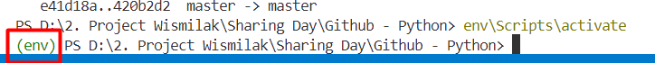
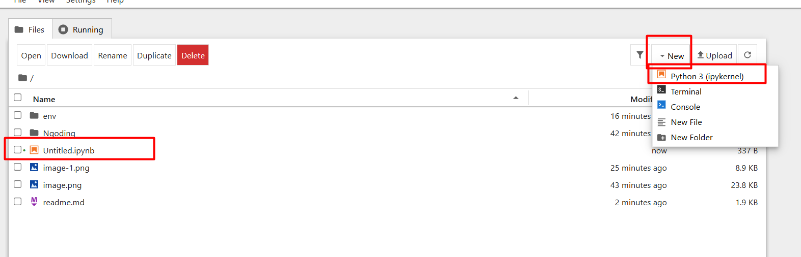

## 👋 Selamat Datang di Python 👋
- Python dibuat dan dikembangkan oleh Guido Van Rossum, programmer yang berasal dari Belanda.

- Python adalah bahasa pemrograman yang mudah dipelajari dan sering digunakan dalam berbagai bidang, seperti pengembangan web, analisis data, kecerdasan buatan, pengembangan aplikasi desktop, dan banyak lainnya lagi.

## Menyiapkan Folder Project
- Siapkan Folder Project Kosong

- Buat environment instalasi python di dalam folder tersebut

```python
python -m venv env
```

Virtual Environment (venv) adalah lingkungan terisolasi yang memungkinkan kita menginstal library Python secara terpisah dari sistem utama. Ini berguna untuk:
1. ✅ Menghindari konflik antar proyek yang memerlukan versi library berbeda.
2. ✅ Menjaga sistem tetap bersih tanpa harus menginstal library secara global.
3. ✅ Memudahkan pengelolaan dependensi proyek.

- Aktifkan Virtual Environment (Windows)
```python
env\Scripts\activate
```
- Aktifkan Virtual Environment (MAC)
```python
source env/bin/activate
```
- Cek Status Virtual Environment



## Instalasi Jupyter Notebook
- Install Jupyter Notebook

```python
pip install notebook
```

- Untuk menjalankan Notebook lakukan perintah

```python
jupyter notebook
```

Jupyter Notebook adalah aplikasi berbasis web yang digunakan untuk membuat dan berbagi dokumen yang berisi:
1. 📌 Kode Python yang dapat dijalankan secara interaktif
2. 📌 Visualisasi data (grafik, tabel, dll.)
3. 📌 Catatan (Markdown, teks, gambar, dll.)

Dokumentasi : https://jupyter.org/install

- Membuat file .pynb untuk melakukan typing kode python



### Print Dasar Python

- Contoh `Hello World` pada python

```python
print("hello pak it")
print("apa kabar ?")
```

### Struktur Dasar Python

- Sintaks Dasar

Python menggunakan indentasi untuk menandai blok kode:

```python
a = 'malam'
if a != 'malam':
    print("Pagi Pak IT !")
else:
    print("Malam Pak IT !")
```

- Variabel dan Tipe Data

```python
x = 10      # Integer
y = 3.14    # Float
z = "Hello" # String
print(type(x), type(y), type(z))
```