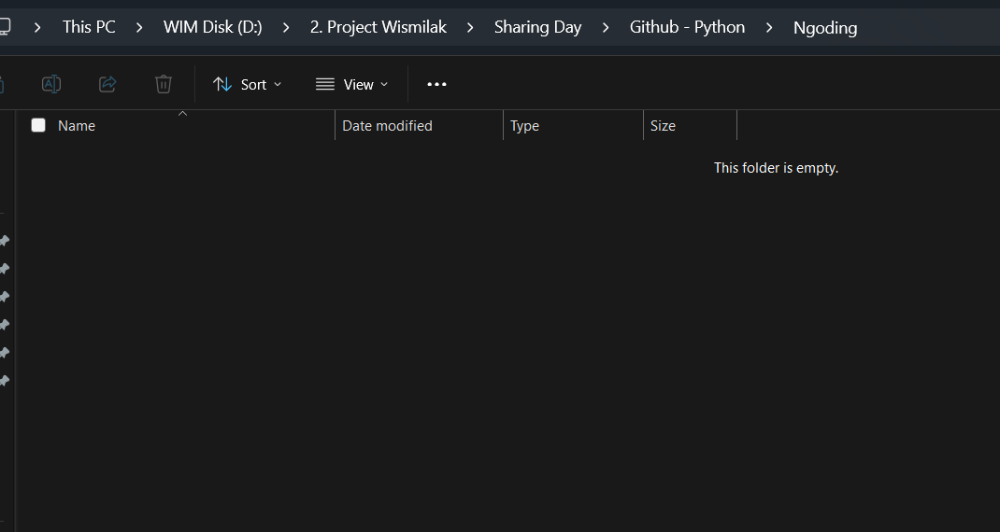

## 👋 Selamat Datang di Python 👋
- Python dibuat dan dikembangkan oleh Guido Van Rossum, programmer yang berasal dari Belanda.

- Python adalah bahasa pemrograman yang mudah dipelajari dan sering digunakan dalam berbagai bidang, seperti pengembangan web, analisis data, kecerdasan buatan, pengembangan aplikasi desktop, dan banyak lainnya lagi.

## Menyiapkan Folder Project
- Siapkan Folder Project Kosong

- Buat environment instalasi python di dalam folder tersebut

```python
python -m venv env
```

Virtual Environment (venv) adalah lingkungan terisolasi yang memungkinkan kita menginstal library Python secara terpisah dari sistem utama. Ini berguna untuk:
- ✅ Menghindari konflik antar proyek yang memerlukan versi library berbeda.
- ✅ Menjaga sistem tetap bersih tanpa harus menginstal library secara global.
- ✅ Memudahkan pengelolaan dependensi proyek.

## Instalasi Jupyter Notebook

```python
pip install notebook
```

Dokumentasi : https://jupyter.org/install

<!--  -->

### Struktur Dasar Python

- Contoh `Hello World` pada python

```python
print("hello pak it")
print("apa kabar ?")
```

###